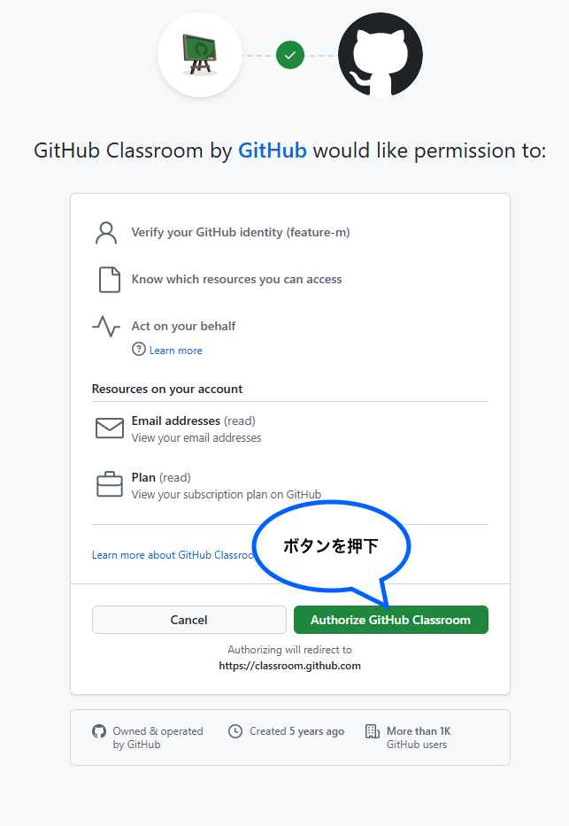
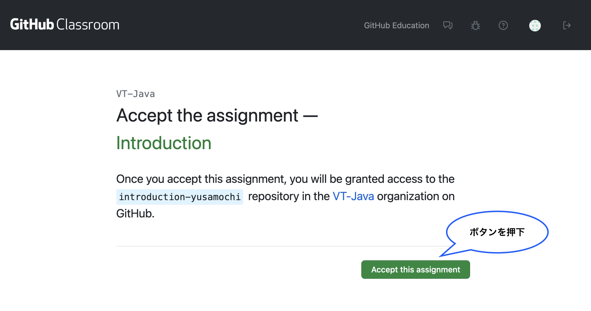
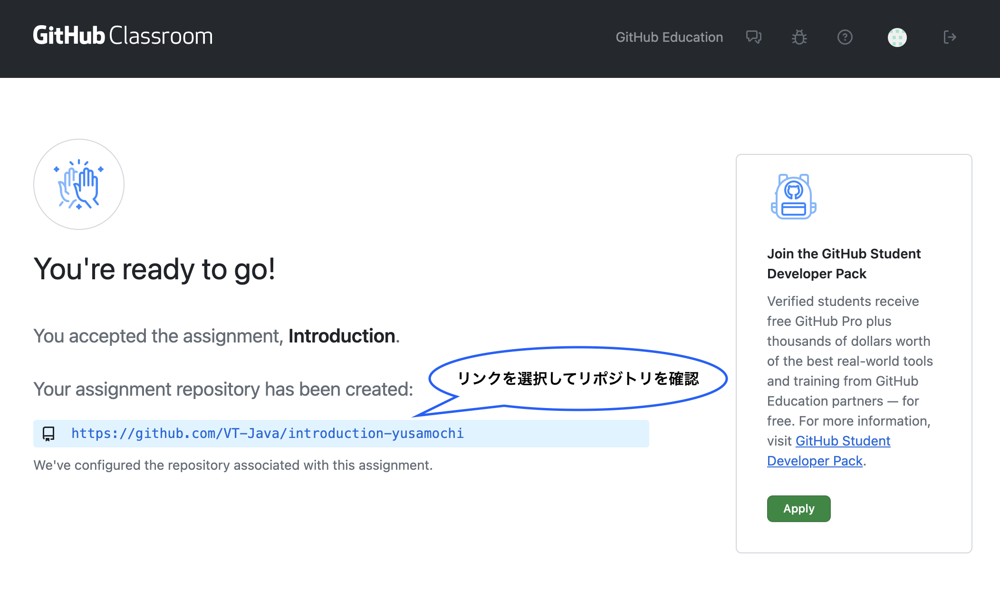

# VT Java 学習用

## 環境構築

### 1. VSCodeの準備

以下のリンクからVSCodeをダウンロードし、インストールする

* VSCode
    * https://code.visualstudio.com/

### Extensionの追加

VSCodeを開き、拡張機能から以下を検索してインストールする

* 必須
    * Extension Pack for Java
* 任意
    * Japanese Language Pack for Visual Studio Code
    * Trailing Spaces
    * Better Comments

### 2. Gitリポジトリのインポート

1. 配布したリポジトリの招待リンクにアクセスし、「Authrize Github Classroom」ボタンを押下する

* ログインが必要な場合はログインする



2. 課題にアサインする

* Classroom: VT-Java
* 課題: Introduction



3. リポジトリが作成されていることを確認する



### 3. 作業ディレクトリの作成
例）`/Vantan/Workspace` 直下にリポジトリを置く場合

```sh
# 任意のディレクトリに作業用ディレクトリを作成 & 移動
# - 任意のディレクトリ = /Users/ユーザー名/Vantan/Workspace
mkdir 任意のディレクトリ && cd 任意のディレクトリ
```

### 4. リポジトリのクローン

以下の手順に従いリポジトリをローカル環境にクローンする

```sh
# 1. 自身の現在のディレクトリを確認し、作業場所にいない場合は移動する
# - pwd: 自身の現在いるディレクトリのパスを表示する
pwd

# 2. リポジトリをクローンする
# - 「Githubのユーザー名」は自身のGithubアカウント名と置き換えてください
git clone git@github.com:VT-Java/introduction-Githubのユーザー名.git

# 3. プロジェクトのルートディレクトリへ移動
# - 「Githubのユーザー名」は自身のGithubアカウント名と置き換えてください
cd introduction-Githubのユーザー名

# 4. ブランチの確認（利用可能な作業場所となるブランチを確認する）
git branch

# 5. gitの差分チェック（余計な差分などがないか念の為確認する）
git status
```

※コマンドではなくVSCode上のGUIによる操作でクローンすることも可能です

### 5. JDKの設定

Javaでアプリケーションを作成するために必要な道具の設定を行います

ターミナル（MacOS標準のターミナルや、VScode上のターミナル）、その他ターミナル機能を持つシェルツール等で実行してください

```sh
# 1. 作業リポジトリに移動
# e.g.) ~/Users/ユーザー名/Workspace/introduction-Githubのユーザー名
# - 「ユーザー名」は自身のローカルの名前、「Githubのユーザー名」は自身のGithubアカウント名と置き換えてください
cd ~/Users/ユーザー名/Workspace/introduction-Githubのユーザー名

# 2. set_permissions.shの実行許可を付与
chmod +x Scripts/set_permissions.sh

# 3. 実行許可スクリプトを実行（環境構築用のシェルファイルに実行許可を与える）
./Scripts/set_permissions.sh

# 4. 使用するJavaのsetupを実行
./Scripts/setup.sh
```

### 6. JDK Runtimeの設定

> 前提

VSCode上で使用するJDKを設定します
まずは、VSCode上部メニューの「ファイル」>「フォルダーを開く」から、先程クローンしたリポジトリのあるディレクトリ名（introduction-Githubのユーザー名）を選択して開いてください

プロジェクトを完全に読み込むのに時間がかかるため、しばらく待機します
（完了の目安としては、VSCode下部バーに「☕Java: Ready」というワードが表示されていればOKです）

> JDK Runtimeの設定

1. 「Command + Shift + P」でコマンドパレットを開き、'Configure Java Runtime' と入力する
2. タブ「JDK Runtime」 を確認し、Javaバージョンが 'JavaSE-17' となっていることを確認する
3. 「JavaSE-17」となっていない場合、一覧に表示されているJDKから「JavaSE-17」を設定する
  * もし「JavaSE-17」が存在しない場合、「Find a local JDK...」よりsdkmanのJDK（17.0.15-tem）を選択する
  * また、「JavaSE-17」となっていない場合は、手順4以降を実施する
4. Finderを開き、上部メニューの「移動」を選択する
5. メニュー下部にある「フォルダへ移動」を選択し、setup.shでログ出力されたsdkmanのパスの一部を入力し移動する
  * `/Users/ユーザー名/.sdkman/candidates/`
6. Javaフォルダが表示されるので、Finder左側の「よく使う項目」にドラッグアンドドロップする
7. 再度、手順の1〜3実施する

※ sdkmanのJDK（17.0.15-tem）を選択するとしていますが、厳密には ./Scripts/setup.sh を実行してインストールされたjdkのバージョンを指定してください